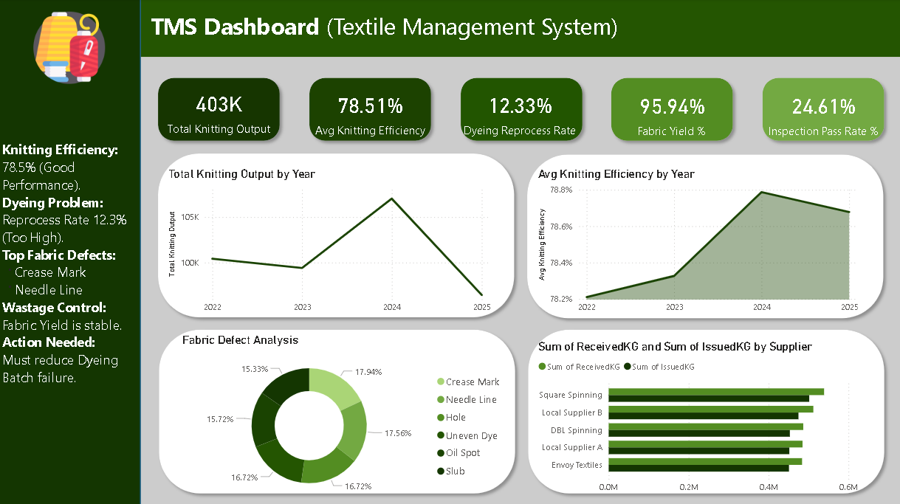
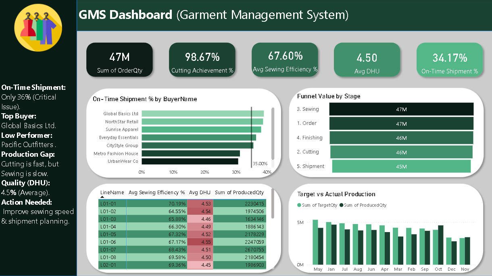
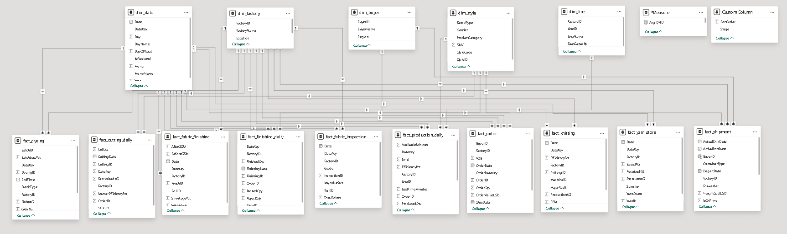

# 🧵 End-to-End RMG Data Analytics (Power BI Project)

## 📌 Project Overview
This project provides a complete **Business Intelligence (BI) solution** for the Ready-Made Garments (RMG) industry. It analyzes the entire production lifecycle—from **Yarn to Shipment**—identifying bottlenecks in knitting, sewing, and logistics.

The goal is to help management reduce fabric wastage, improve machine efficiency, and ensure on-time shipments using data-driven insights.

---

## 📊 Dashboard Visuals & Data Model

### 1️⃣ Textile Management Dashboard (TMS)
*(Focus: Yarn Stock, Knitting Efficiency, Fabric Quality)*

### 2️⃣ Garment Management Dashboard (GMS)
*(Focus: Order Booking, Sewing Lines, Buyer Performance)*

### 3️⃣ Data Model (Star Schema)
*(Designed a complex data model connecting 15+ tables)*

---

## 💡 Key Insights & Findings

### 🧵 Textile Section (TMS):
- **✅ Knitting Efficiency:** Strong performance at **78.5%**.
- **⚠️ Critical Issue:** **Dyeing Reprocess Rate is 12.3%**, leading to chemical wastage.
- **📉 Top Defects:** "Crease Marks" and "Needle Lines" are the major quality concerns impacting fabric yield.

### 👕 Garments Section (GMS):
- **⚠️ Major Risk:** Only **36% of shipments are On-Time**. Immediate planning improvement needed.
- **🏆 Top Buyer:** **"Global Basics Ltd"** (Consistent & Profitable).
- **🚚 Logistics:** High dependency on **"Truck to Port" (33%)**, indicating unplanned and costly shipments.

---

## 🛠️ Tech Stack & Tools Used
- **Microsoft Power BI:** For interactive dashboards and data visualization.
- **Power Query:** For ETL (Extract, Transform, Load) and data cleaning.
- **Star Schema:** Designed a complex data model connecting 15+ tables.
- **DAX Measures:** Calculated "On-Time Delivery %", "Cut-to-Ship Ratio", "DHU", and "Efficiency".
- **Excel:** Used as the raw data source.

---

## 📂 Project Structure
- **Assets/** : Contains dashboard screenshots and data model images.
- **Datasets/** : Contains raw Excel files (Orders, Production, Shipment).
- **.pbix File** : The main Power BI project file.

---
**Author:** Dishan  
*Aspiring Data Analyst & Software Engineer* *Daffodil International University*
